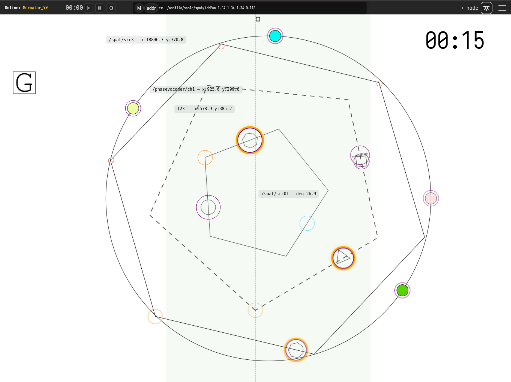

## Overview

*A Walk in a Polygon Field* is a page-based graphic score environment for controlled improvisation. The score consists of three rotating polygons (5-, 6-, and 7-sided) and an outer circular path carrying four orbiting objects. Performers activate and control objects that orbit these polygons, interpreting visual motion as sonic material. An electronics performer manages spatialisation, processing, and the four outer ring objects.

The piece functions as a framework: the score defines available states, behaviours, and constraints, while performers negotiate interpretation, timing, and sonic realisation.

---

## Score Elements

### Polygons

Three polygons occupy the central field: a pentagon, hexagon, and heptagon. Each rotates at a different rate, producing polymetric phase relationships (5-against-6-against-7). The sides of each polygon are visually distinguished by colour and line style (solid, dashed, dotted).

### Objects

Small objects orbit along the edges of each polygon. When active, an object moves continuously around its polygon's perimeter. The combination of the object's orbit and the polygon's rotation produces compound motion across the screen.

### Outer Ring

A circular path surrounds the polygon field, carrying four orbiting objects dedicated to spatialisation and electronic control.

### Timer

A visible timer runs throughout the performance, helping performers coordinate pacing and endings. (In projected versions for audience, this may be hidden.)

---

## For Instrumentalists

### Preparing

Before rehearsing or performing, spend time with the score. Watch how the polygons rotate, how objects orbit, and how these motions combine. Notice what situations arise: crossings, alignments, convergences, separations. Consider what the interface affords your instrument and your musical thinking—which states invite sustained sound, which encourage gesture, which suggest silence or restraint.

You are not following instructions in a conventional sense. You are developing a practice for navigating this environment. The score provides structure; you decide what that structure sounds like.

### Reading the Score

You read the score on your own tablet or laptop, connected to the local network. Touch gestures activate and stop objects; no external controller is needed. Interact deliberately—accidental taps will trigger changes. Keep the screen visible, but avoid becoming trapped by it. Shift your attention between the interface, your fellow performers, and the sound in the room. The score is one input among several.

### Activation

Objects begin inactive (greyed out). To enter the piece, click or touch the handle on your chosen object to activate it. The object will highlight and begin orbiting. Decide entry order with your ensemble before performance, or negotiate entries in the moment.

A global start button is available if you prefer synchronised entries, but manual activation allows staggered, overlapping entrances.

### Interpretation

Each side of a polygon represents a discrete performance state. What this means is yours to decide:

- A change in pitch region or register
- A shift in articulation or attack mode
- A microtonal inflection within a sustained drone
- A new rhythmic pattern or density
- A textural transformation

The visual distinctions (colour, line style) may guide your mapping, or you may ignore them entirely. Negotiate shared conventions with your ensemble, or develop individual responses.

### Motion and Position

Your object's position results from two simultaneous motions: its orbit along the polygon edge and the polygon's own rotation. Depending on direction and speed, your object may:

- Move rapidly through screen quadrants
- Linger in one area
- Cross paths with other objects

You may choose to interpret screen position (quadrants, proximity to centre/edge, nearness to other objects) as additional parameters—or not.

### Changing Objects

After completing at least one full orbit, you may stop your object and claim a different inactive object. Alternatively, negotiate other constraints with your ensemble:

- Change only when orbits cross
- Change only on entering a new screen quadrant
- Change only after a set duration

Two performers cannot control the same object simultaneously. If you wish to take a solo, you may stop other performers' objects—but use this affordance thoughtfully.

### Stopping

To stop playing, click your object to deactivate it. It will fade to grey. You may:

- Stop immediately
- Stop after reaching a particular polygon side or screen position
- Fade out gradually while the object is still active

Decide with your ensemble whether inactive objects freeze in place or continue orbiting silently.

---

## For the Electronics Performer

### Role

You manage live processing, spatialisation, and the four outer ring objects. Depending on setup, you may also act as conductor/director (see below).

### Outer Ring Objects

The four objects orbiting the outer circle are yours to control. These generate OSC data for spatialisation. Activate, pause, or adjust them to shape the spatial field around the instrumental texture.

### OSC Streams

Active objects and polygons send OSC data:

- **Object orbit position:** normalised angle along polygon edge
- **Polygon rotation:** current rotation angle
- **Object scale:** if scaling animations are active
- **Polygon scale:** if scaling animations are active

Addresses are fixed and named according to object and polygon identifiers (see score legend for specific addresses).

### Processing

A SuperCollider patch is provided offering:

- Minimal synthesis (drone pads)
- Ring modulation
- Delay and reverb
- Granular processing
- Quadraphonic (or higher) spatialisation

Mix and apply processing in response to the ensemble. You may also build your own mappings if preferred.

### Mixer Role

Balance the acoustic and electronic layers. The processing should support and extend the instrumental sound, not dominate it—unless the ensemble decides otherwise.

---

## For the Conductor / Director (Optional)

If performing from a single projected score rather than individual tablets, a conductor/director operates the master control:

- Activate and deactivate performer objects on their behalf
- Signal entries, transitions, and endings through gesture
- Control global functions (start, fade, timer)

In this configuration, you are conducting the score as much as the performers. Coordinate entries, encourage transitions between polygons, and shape the arc of the performance.

Even with individual tablets, an ensemble may designate a director to make structural decisions—when to build, when to thin, when to end.

---

## Duration and Ending

The target duration is approximately 8 minutes, but this is flexible.

### Possible Ending Strategies

Negotiate an ending approach before or during performance:

- **Synchronised stop:** All performers stop together after reaching a climax or target time
- **Staggered fade:** Performers deactivate objects one by one, thinning the texture gradually
- **Global fade:** Use the fade-all button to fade all active objects over a set duration (e.g., 2 minutes)
- **Drone and decay:** Settle into a sustained drone, then fade

A timer is visible to help coordinate. For example, you might agree: "Build density until 6 minutes, then begin staggered exits, aiming to finish around 8."

---

## Suggested Interpretation Strategies

These are starting points—develop your own approach.

### Drone-based

Treat each polygon side as a pitch region. Sustain long tones, shifting microtonally or registrally as sides change. Let the polymetric rotation create slow phase patterns.

### Gestural / Pointillist

Respond to object motion with short, articulated gestures. Attacks align with vertices; sustained sounds fill the sides. Density follows orbit speed.

### Textural Accumulation

Begin sparse. Gradually activate more objects, layer entries, build density toward a climax, then thin out.

### Spatial Counterpoint

Map screen position to register or timbre. Objects in different quadrants occupy different sonic territories. Crossings create moments of intersection.

---

## Summary

- Activate objects by clicking; deactivate to exit
- Each polygon side = a change in state (your interpretation)
- Complete at least one orbit before changing objects
- Negotiate entry order, transitions, and endings with your ensemble
- Electronics performer controls outer ring, processing, and spatialisation
- Target duration ~8 minutes; coordinate using the visible timer
- The score provides structure; you provide the sound

---

## Resources

- Score and army: https://robcanning.github.io/oscilla/compositions/polygonwalk2026
- Oscilla documentation: https://robcanning.github.io/oscilla/
- Questions: rc@kiben.net

## Short Biography

Rob Canning is an Irish composer, improviser, and creative technologist whose work explores animated notation, improvisation, and the dynamics of networked musical systems. He holds a PhD in composition from Goldsmiths, University of London, where his research examined distributed authorship in computer-aided music. A long-time advocate of Free and Open Source Software, he develops Oscilla, an open-source platform for animated graphic notation and networked performance.

## Programme Note

A Walk in a Polygon Field (2025/26)

The title gestures toward walking as a way of knowing—slow movement through a place, attentive to edges, paths, obstacles, unexpected turns. The field called "Polygon" is imaginary, yet precise: shapes rotate at different rates (5-against-6-against-7), creating polymetric cycles. Objects orbit, collide, separate, phase. These movements are not metaphors for music—they are material. Musicians activate these objects, navigate their motions, translate what they see into sound. The piece asks performers not to read, but to inhabit—to learn the score's rhythms, its frictions, what it permits or resists.

Each musician controls one object at a time. Activating it sets motion in play. Deactivating withdraws from the shared texture. The field is never neutral. Choices ripple outward: density shifts, pacing changes, social balance tilts. Sometimes the system invites sustained sound and patient listening. Other times, sudden alignments provoke reaction—quick gestures, sharp attacks, convergence.

The score provides landmarks; musicians decide what those landmarks sound like. A polygon edge might signal a shift in pitch region, articulation, texture. Performers may develop shared conventions or follow individual logic. The system shapes possibility without prescribing outcome.
This concerns attitude more than correctness: attention, restraint, curiosity, trust. The piece rewards musicians willing to observe first, contribute sparingly, let relationships form gradually. Silence is not absence but active position. Intensity arises not because written, but because it emerges—from overlapping processes, shared decisions, friction between what the score does and what players choose.

An electronics performer shapes the spatial field. Live processing extends instrumental sound—textures that bloom and decay. The score runs on networked tablets, its infrastructure invisible, holding balance: enough structure to orient, enough openness to leave music unresolved until played.

Each performance traces a different route, shaped as much by personalities in the room as by shapes on screen. What emerges is neither fully composed nor entirely improvised—something negotiated, music grown from shared encounter with a moving score.

## Screenshots

