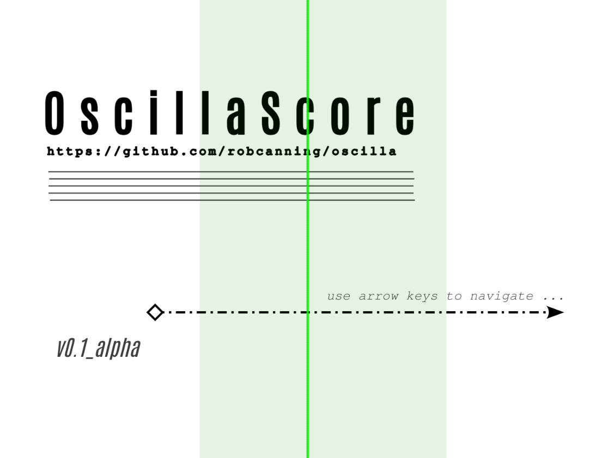

  

OscillaScore is an open-source platform for creating and performing time-based, animated notation in the browser. It supports collaborative performance, synthesis control, and visual experimentation using simple SVG and web technologies.

##  What Can OscillaScore Do?

- Synchronize score playback across local devices or remote performers
- Trigger audio, events, or OSC messages via cues
- Combine open-form and fixed-form structures for hybrid performance formats
- Animate shapes, symbols, and cues using custom SVG syntax
- Run entirely in the browser — no installation required

---

-  Full documentation and source code on [GitHub](https://github.com/robcanning/oscilla)

## What Kind of Software Is OscillaScore?

OscillaScore is best described as a hybrid system that sits between score playback engine, cue-based media framework, and distributed performance interface.

**It is:**

- A cue-driven score playback and control system for structured, time-based, and media-integrated works  
- A networked playback environment supporting multi-client synchronization via WebSockets and OSC  
- A performance framework for distributed setups, allowing composers and performers to coordinate audio, animation, and media in real time  
- A score authoring platform supporting compact mini-syntax for animation, transformation, and timing control using SVG ID conventions  

**It is not:**

- A real-time collaborative score editor  
- A DAW or audio sequencing environment  
- A full-featured notation program like MuseScore or Sibelius  

OscillaScore is designed to support composers and performers working with contemporary forms of notation, multimedia integration, and distributed coordination.

## Conceptual Overview

OscillaScore supports both fixed-form and open-form works, and can be used in isolation as a powerful environment for structuring electronic music compositions. It accommodates a range of artistic practices including:

- Animated graphic or symbolic scores  
- Distributed improvisation and comporovisation  
- Time-based cue sequences and gesture triggers  
- Media scores involving video, audio, or text prompts  
- Live networked performances and collaborative rehearsals  

It builds on the lineage of drawing-based music systems like Xenakis’s UPIC, reimagining the score as a spatial interface for sonic control. With support for animation and OSC, OscillaScore acts as both a form of notation and a performable instrument, allowing users to control sound through movement, timing, and visual gesture.

**It operates under two main paradigms:**

- A scrolling score model, suited for linear, horizontally-unfolding timelines  
- A page-based or hypertextual model, allowing spatial, nonlinear, or interactive structures  

These paradigms can coexist within a single score, enabling hybrid forms that mix continuous motion with branching or triggerable segments.

OscillaScore tightly integrates notation, performer cues, media triggers, and animation into a unified timing and control system. This allows complex audiovisual structures to be executed with precise coordination — ensuring seamless transitions between written material, live gestures, and multimedia elements.

Composers and performers can author complex transformations, animations, and media events using a concise SVG ID-based syntax paired with a powerful cue system.

## Use Cases

OscillaScore supports a wide range of use cases, including:

- **Score composition for ensembles**: Design dynamic, cue-based scores using SVG animations and transformation syntax tailored for group performance  
- **Rehearsal and performance for ensembles**: Share synchronized score playback with multiple musicians in real time using WebSockets or OSC
- **Telematic and distributed improvisation**: Use cues and visual animations to coordinate remote performers across networks  
- **Solo electronic music composition**: Compose and structure media-rich or animated works within a single local environment  
- **Interactive installations**: Embed visual or spatial scores in gallery contexts with OSC-driven sound interaction  
- **Mixed-media or hypermedia works**: Integrate text, video, sound, and interactivity in dynamic score designs  

---
##  Create Scores with Inkscape

OscillaScore is designed to work with [Inkscape](https://inkscape.org/) — a free, open-source vector graphics tool.

- Download: [inkscape.org/release](https://inkscape.org/release/)
- Use OscillaScore templates and naming conventions for animated SVG scores
- See [GitHub](https://github.com/robcanning/oscilla) for templates and examples

---
## Interactive Help Score File

Oscilla comes with an interactive help file help.svg. Here are some screenshots from the help score:



  
    
  

---

## PonySays Trio using Oscilla @ MusicCurrent Festival 2025

<iframe width="560" height="315" src="https://www.youtube.com/embed/6LMr5QH07kk?si=8P0dZc2AABIRCOYN" title="YouTube video player" frameborder="0" allow="accelerometer; autoplay; clipboard-write; encrypted-media; gyroscope; picture-in-picture; web-share" referrerpolicy="strict-origin-when-cross-origin" allowfullscreen></iframe>

---

## Workshops

OscillaScore workshops explore graphic notation, live performance, and networked interaction. These sessions are designed for composers, improvisers, and artists working at the intersection of sound, code, and visual media — exploring new modes of performance, interaction, and notation. OscillaScore workshops can be adapted to:

- Experimental music ensembles
- Improvisation collectives
- Composition/technology courses
- Hacklabs and interdisciplinary events

Workshops typically include live demos, collaborative score creation, and integrations with synthesis, spatial sound, or video. Please get in touch if you are interested in hosting a workshop.

---

## Papers in Preparation

One or more research papers related to Oscilla are currently in preparation for submission to peer-reviewed academic conferences. Due to the requirements of the double-blind review process, these preprints cannot be shared publicly at this stage. They will be made available here once the review process has concluded.

## Community & Support

- [GitHub Discussions](https://github.com/robcanning/oscilla/discussions)
- [Join Matrix Chat](https://matrix.to/#/#oscilla:matrix.org)
- [Follow @rob@toot.si](https://toot.si/@rob) on Mastodon

---

  

## Contact

For workshops, collaborations, or support:
- Email: <a href="mailto:rscanning@gmail.com">rscanning@gmail.com</a>
- Mastodon: [@rob@toot.si](https://toot.si/@rob)

---

---